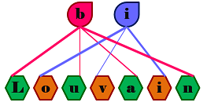
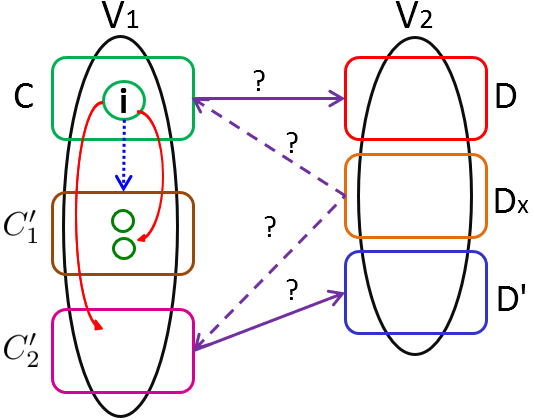

  

                      

C++ code for efficient detection of communities in bipartite networks.

# Research Problem

Community detection is a widely-used operation in graph theory. The goal is to partition the vertex set of an input graph into tightly-knit groups or “communities", such that vertices that are assigned to a community have a higher density of edges among them than to the vertices in the rest of the network. Numerous efficient algorithms have been developed for community detection in unipartite networks [S. Fortunato, 2010]. However, its treatment in bipartite networks has been sparse [M. J. Barber, 2007, R. Guimerà et al., 2007, X. Liu and T. Murata, 2010]. In our research, we visit the problem of community detection in bipartite networks which has a critical impact in the analysis of complex biological data where there are two different types of interacting entities (e.g., genes and diseases, drugs and protein complexes, plants and pollinators, hosts and pathogens). 

Our biLouvain algorithm uses a variant of the bipartite modularity function defined by Murata, which we called Murata+, as the optimization function. Although the idea of modularity optimization to solve the community detection problem is not new, to the best of our knowledge our proposed approach hasn’t been tried before and it lead us to a better understanding of the structural properties of the bipartite networks as well as to improve modularity results and performance. 

Once the communities have been obtained the next steps are analysis and interpretation of them. These domain specific tasks have direct impact on other studies for example: in the case of the gene-drug network we could identify groups of drugs that might inhibit or otherwise modulate groups of genes. We also could detect groups of genes that are suitable for drug targeting but may not currently have a drug targeting them. Similarly, for plant-pollinator networks we could identify groups of pollinators that limit or promote plant species establishment and persistence.

For further details about Murata+ definition and biLouvain algorithm please refer to:

**Pesantez-Cabrera, Paola, and Ananth Kalyanaraman. "Detecting Communities in Biological Bipartite Networks." In Proceedings of the 7th ACM International Conference on Bioinformatics, Computational Biology, and Health Informatics, pp. 98-107. ACM, 2016., doi: 10.1145/2975167.2975177.**

**Pesántez-Cabrera, Paola and Ananth Kalyanaraman. "Efficient Detection of Communities in Biological Bipartite Networks." In IEEE/ACM Transactions on Computational Biology and Bioinformatics, vol. 16, no. 1, pp. 258-271, 1 Jan.-Feb. 2019, doi: 10.1109/TCBB.2017.2765319.**
  

# biLouvain (Last release)
Updated biLouvain algorithm code that allows to use not just inter-type but also intra-type information of a given bipartite network.
It also provides the option to intergate the Multi-fuse preprocessing step to work with really large networks.

  

   

# Contact
Paola Gabriela Pesantez-Cabrera, Ananth Kalyanaraman (p.pesantezcabrera@wsu.edu, ananth@eecs.wsu.edu)

